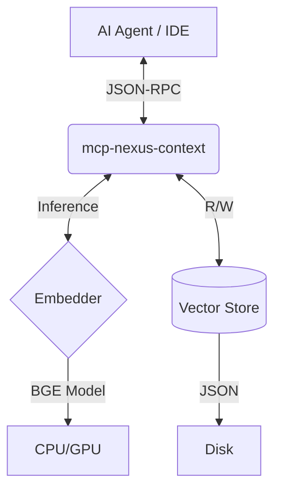

# 🧠 mcp-nexus-context
### *Local Vector Database & Infinite Context Memory*


> **"A Second Brain for your AI Agents, running locally."**

---

## 👨‍💻 Author
**Created & Architected by:** Willer Xavier Reis  
**Date:** November 2025

---

## 🚀 What is mcp-nexus-context?

A specialized **Model Context Protocol (MCP)** server that gives your AI Assistant (Windsurf, Cursor, Claude) **infinite long-term memory**. 

Unlike cloud-based solutions, it runs **100% locally** on your machine, indexing conversations, architectural decisions, and code snippets into a vector database for instant semantic retrieval.

### ✨ Key Features
- **⚡ Blazing Fast:** Rust-native with near-zero latency
- **👁️ Real-time Watcher:** Monitors project files and updates context instantly
- **🔒 Privacy First:** No data leaves your machine
- **🧠 SOTA Embeddings:** `BAAI/bge-base-en-v1.5` (BERT) for high-precision semantic search
- **🔋 CPU/GPU Ready:** Auto-detects hardware (CPU optimized by default)
- **💾 Simple Storage:** JSON-based persistence (no complex databases)
- **🌍 Cross-Platform:** Windows, Linux, macOS

---

## 🛠️ Installation

### Prerequisites
- **Rust:** [Install Rust](https://www.rust-lang.org/tools/install)
- **Python 3.10+:** (one-time model download only)

### Setup
```bash
# 1. Clone the repository
git clone https://github.com/willerxar-cmyk/mcp-nexus-context.git
cd mcp-nexus-context

# 2. Download AI model (~438MB)
python download_model.py

# 3. Build (optional, for binary execution)
cargo build --release
```

**Binary locations after build:**
- **Windows:** `target/release/mcp-nexus-context.exe`
- **Linux/Mac:** `target/release/mcp-nexus-context`

---

## ⚙️ Configuration

Add one of these configurations to your IDE's MCP settings file (`mcp_config.json`):

### Option A: Pre-compiled Binary (Recommended)
```json
{
  "mcpServers": {
    "mcp-nexus-context": {
      "command": "C:/ABSOLUTE/PATH/TO/mcp-nexus-context/target/release/mcp-nexus-context.exe",
      "env": {
        "RUST_LOG": "info"
      },
      "autoApprove": ["search_context", "add_memory"]
    }
  }
}
```

### Option B: Run from Source (Cross-Platform)
```json
{
  "mcpServers": {
    "mcp-nexus-context": {
      "command": "cargo",
      "args": ["run", "--release"],
      "cwd": "/ABSOLUTE/PATH/TO/mcp-nexus-context",
      "env": {
        "RUST_LOG": "info"
      },
      "autoApprove": ["search_context", "add_memory"]
    }
  }
}
```

---

## 🤖 AI Agent Instructions

Add this to your agent's **Custom Instructions**:

```markdown
You have access to 'mcp-nexus-context', a local vector memory tool.

- **Before answering:** Call search_context(query) to retrieve relevant past context.
- **When learning:** Call add_memory(text, metadata) to save important information.
```

---

## 🧪 Testing

```bash
python test_mcp_client.py
```
Expected: Successful initialization, memory addition, and semantic search.

---

## 🏗️ Architecture



---

*Made with ❤️ for Local AI - Willer Xavier Reis, 2025*
